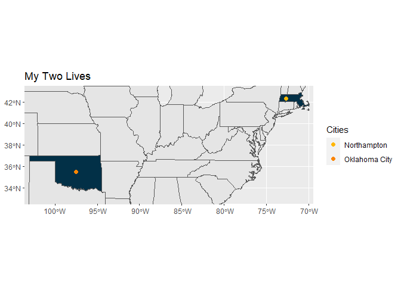
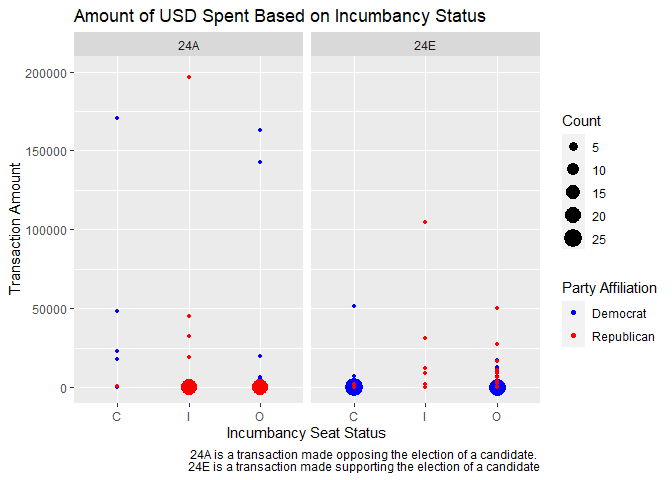

Introduction
================

## Nice to Meet You

Hi! I am Sophia, a statistical and data sciences major undergrad who wishes to help people by
combining statistics with social sciences. I am most comfortable with
R, but I also use Stata. [Email me](mailto:ssilovsky@smith.edu) if you
have any questions or just wish to reach out. Have a splendid day!

------------------------------------------------------------------------

### Plots

Here are a few example plots just to demonstrate what I know. :blush:

<!-- -->

<!-- -->      
*used with data from the fec16 package
